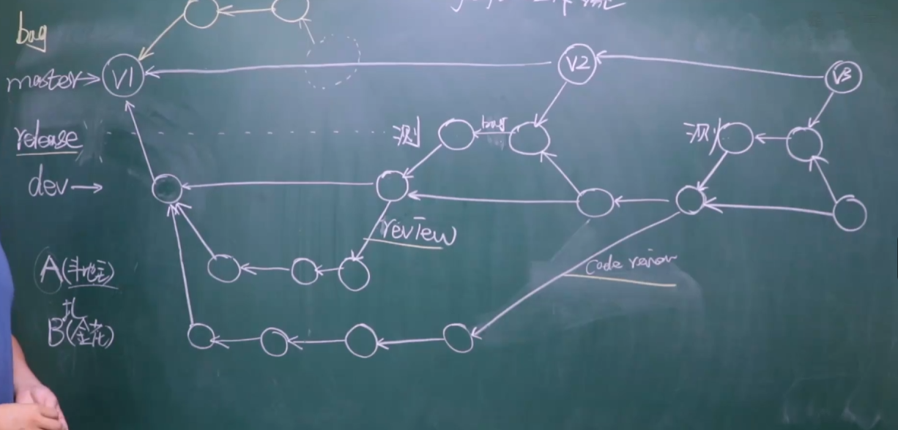

# git学习笔记

# git命令

## 配置全局邮箱：

### 初次配置之后即可
`git config --global user.email "you@example.com"`
`git config --global user.name "your name"`

## 版本提交命令

- `git init` 初始化。即让git帮助我们管理文件
- `git status` 检测文件夹下的文件状态
- `git add 文件名.文件拓展名` 将指定文件添加文件到暂存区（添加的文件将被git管理）
  - `git add .`添加所有文件到暂存区
- `git commit -m'v1'` 提交代码到版本库（本地仓库）
### 提交命令使用步骤
- 先使用`git status` 检测所有未被添加的文件，新增的或者修改的文件会变为红色。
- 使用`git add` 文件名.扩展名 添加指定文件，或者使用`git add .` 添加所有文件。已经被添加的文件会变为绿色。
- 使用`git commit -m'版本描述信息'` 提交文件并生成版本。提交完成之后文件，就会变为原色。

## git日志

- `git log` 查看日志（版本更新记录）
- `git log --graph`查看流行图日志
- `git log --graph --pretty=format:"%h %s"`简洁显示

## 版本回滚

- `git reset --hard 版本号` 将代码或文件退回到指定的版本
- `git reflog` 查看包括回滚版本在内的日志
- 曾经被回滚的版本可以通过`git reflog`来查看日志找到版本号，然后进行回滚

## 分支

### 分支操作命令
- `git branch 分支名`创建分支
- `git branch`查询分支
- 测试文字，测试修复bug分支
- 测试文字，新功能，解决分支冲突
- `git checkout 分支名`切换分支
- `git branch -d 分支名` 删除分支
  - `git branch -D 分支名` 强制删除分支（未推送的本地分支）
- `git merge 分支名` 合并分支，将目标分支内容合并到所在的分支
### 分支的作用：
- 默认的主分支通常命名为master，开发中的分支可命名为dev
- 紧急修复线上项目bug，可创建一个新的分支然后再合并。
- 可对各个开发模块做环境隔离
### 工作流
- 创建新的项目时至少需要两个分支master 和 development/dev；master是正式环境dev则作为开发环境

## git rebase

变基，可以使git记录变得简洁
### 使用情形
#### 情形一
将多个git提交记录整合成一个提交记录
- `git rebase -i 版本号`将所输入版本号的版本至最新的版本做一个整合(最多三条)
- `git rebase -i HEAD~3`整合最新的个版本的提交记录。将 "pick"改为"s"即是将该版本合并到上一个版本；完成以上操作后，写上合并记录备注。
- *注意*尽量不要合并已经提交到远程仓库的记录，可能会导致混乱
#### 情形二
将其他分支的提交记录合并到主分支。合并可以使得提交的版本记录变得简洁，但是也会导致信息不如原本详细，在进行操作时需要做一定的取舍
- 操作步骤：
  - 切换到dev分支 ，执行`git rebase master`
  - 切换到master分支，执行`git merge dev`
#### 情形三
在pc端a开发了某个功能的部分代码，未push到远程仓库；又到pc端b开发了某个功能的部分代码后，将该设备上的代码push到远程仓库。在这之后，当我们回到设备a上，pull远程仓库代码时git版本就会在设备a的工作区自动merge，会造成版本上的分叉。可通过rebase将其合并成一个版本记录。
- 在设备a上的操作步骤:
  - 执行`git fetch origin 分支名`
  - 执行`git rebase origin/分支名`
### 注意事项
#### 代码产生冲突
- 若是执行`git fetch origin 分支名`报出了代码冲突的错误，则要先解决代码冲突
- 执行`git rebase --continue`

## 快速解决冲突 （beyond compare）

### 安装beyond compare 
### 在git中配置beyond compare(单个项目中有效)
- `git config --local merge.tool bc5`配置本地解决冲突的工具。“bc3”是工具别名
- `git config --local merge.path 'F:\applacation\Program Files\Beyond Compare 5\BCompare.exe'` 配工具路径，即是beyond compare安装目录
- `git config --local merge.keepBackup false`
### 应用beyond compare 解决冲突
- `git mergetool`

# 多人协同开发
## gitflow 工作流思路
- 上线运行的主分支为master/main，开发分支为dev/development。在日常多人协同开发中，应精确到每个开发者一个分支。可从dev/development为一个单独的功能模块新建一个分支，再从这个功能模块的的分支下为负责开发这个功能模块的每个开发者新建一个分支。当功能开发完成之后，由leader进行code review，确认后可合并到dev分支，再由dev分支合并到master进行上线发布（在上线之前也可能会由dev分支先合并到release分支，进行测试之后，再合并到master上线发布）。
- 已上线的代码出现了bug，应当为这个bug单独新建一个分支进行紧急修复。

# GitHub学习笔记  

## 新建仓库推送代码步骤
### 本地仓库为空的情况
- `echo "# notes" >> README.md`
- `git init`
- `git add README.md`
- `git commit -m "first commit"`
- `git branch -M master`
- `git remote add origin https://github.com/Guige-Wang/notes.git` 设置origin为远程仓库别名
- `git push -u origin master` 推送master分支到远程仓库
### 本地仓库有内容的情况
- `git remote add origin https://github.com/Guige-Wang/notes.git`
- `git branch -M master`
- `git push -u origin master`

## 远程获取项目 
### clone项目
- `git clone 仓库地址`
### 拉取代码
- `git pull origin 分支名称`
- `git pull origin 分支名称`等同于`git fetch 分支名`和`git merge origin/dev`的结合体
- `git fetch 分支名`将远程仓库的代码同步到本地仓库
- `git merge origin/dev`将本地仓库的代码和暂存去的代码合并
### 推送命令
- `git push -u origin 分支名称`

## 由于本地缺少正确的根证书或网络环境限制导致的错误及其解决办法
      $ git push -u origin master
      fatal: unable to access 'https://github.com/Guige-Wang/notes.git/': SSL certificate problem: unable to get local issuer certificate
### Windows（使用系统自带的证书）
`git config --global http.sslBackend schannel`
### Linux/Mac（更新证书）
`sudo apt update && sudo apt install ca-certificates`  # Debian/Ubuntu
`brew update && brew install openssl`                 # Mac