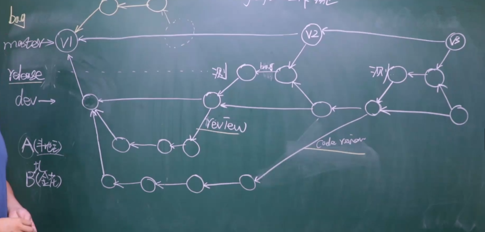
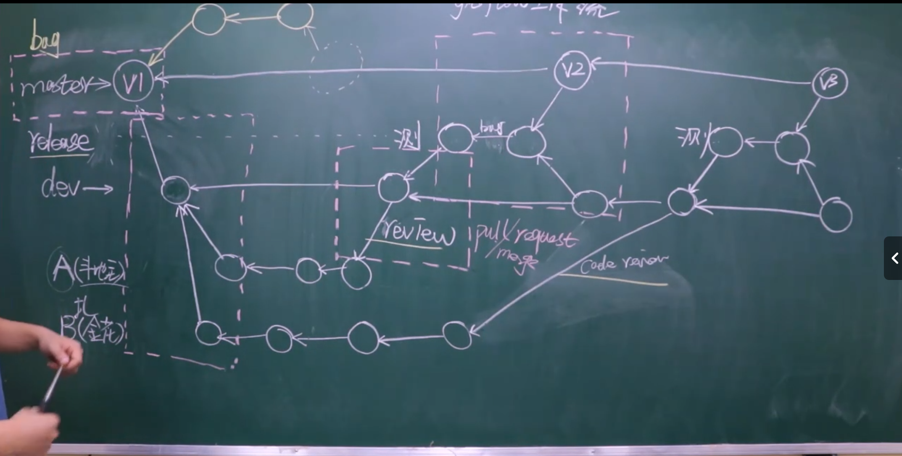

# git学习笔记

## 1 git命令

### 1.1 git配置：

#### 1.1.1 项目配置文件
- 项目配置文件：项目/git/config
  - `git config --local user.email "you@example.com"`
  - `git config --local user.name "your name"`
- 全局配置文件：-/config
  - `git config --global user.email "you@example.com"`
  - `git config --global user.name "your name"`
- 系统配置文件：linux ->/etc/config
    - `git config --system user.email "you@example.com"`
    - `git config --system user.name "your name"`
    - 需要有root权限

#### 1.1.2 证书配置
缺少证书或者网络受限制，会报出以下错误
      $ git push -u origin master
      fatal: unable to access 'https://github.com/Guige-Wang/notes.git/': SSL certificate problem: unable to get local issuer certificate
##### 1.1.2.1 Windows（使用系统自带的证书）
- `git config --global http.sslBackend schannel`
##### 1.1.2.2 Linux/Mac（更新证书）
- `sudo apt update && sudo apt install ca-certificates`  # Debian/Ubuntu
- `brew update && brew install openssl`                 # Mac

#### 1.1.3 免密登录
- url中体现
  - `原来的地址：https://github.com/Guige-Wang/notes.git/`
  - `修改后的地址：https://用户名:密码@github.com/Guige-Wang/notes.git/`
  - `git remote add origin https://用户名:密码@github.com/Guige-Wang/notes.git/`
  - `git push origin master`
- SSH实现
  - 生成公钥和私钥(默认存放位置 ~/.ssh目录下，id_rsa.pub公钥，id_rsa私钥)
    - ssh-keygen -r rsa
  - 拷贝公钥的内容并设置到GitHub中
    - 在settings中添加到相应位置
  - 在git本地中配置ssh地址
    - `git remote add origin git@github.com:Guige-Wang/notes.git`
- git自动管理凭证
  
#### 1.1.4 git忽略文件(gitignore)
- 让git忽略某些文件或目录，不再管理它们。
  - `*.h` #忽略所有以".h"结尾的文件
  - `!a.h` #除了"a.h"以外，忽略所有以".h"结尾的文件
  - `files/` #忽略名为"files"的目录下的所有文件
  - `*.py[a|b|c]`#排除a\b\c
- GitHub上有各种语言的gitignore文件可供参考：
  - https://github.com/github/gitignore


### 1.2 版本提交命令

- `git init` 初始化。即让git帮助我们管理文件
- `git status` 检测文件夹下的文件状态
- `git add 文件名.文件拓展名` 将指定文件添加文件到暂存区（添加的文件将被git管理）
  - `git add .`添加所有文件到暂存区
- `git commit -m'v1'` 提交代码到版本库（本地仓库）
#### 1.2.1 提交命令使用步骤
- 先使用`git status` 检测所有未被添加的文件，新增的或者修改的文件会变为红色。
- 使用`git add` 文件名.扩展名 添加指定文件，或者使用`git add .` 添加所有文件。已经被添加的文件会变为绿色。
- 使用`git commit -m'版本描述信息'` 提交文件并生成版本。提交完成之后文件，就会变为原色。

### 1.3 git日志

- `git log` 查看日志（版本更新记录）
- `git log --graph`查看流行图日志
- `git log --graph --pretty=format:"%h %s"`简洁显示

### 1.4 版本回滚

- `git reset --hard 版本号` 将代码或文件退回到指定的版本
- `git reflog` 查看包括回滚版本在内的日志
- 曾经被回滚的版本可以通过`git reflog`来查看日志找到版本号，然后进行回滚

### 1.5 分支

#### 1.5.1 分支操作命令
- `git branch 分支名`创建分支
- `git branch`查询分支
- `git checkout -b 分支名称`创建并切换分支
- 测试文字，新功能，解决分支冲突
- `git checkout 分支名`切换分支
- `git branch -d 分支名` 删除分支
  - `git branch -D 分支名` 强制删除分支（未推送的本地分支）
- `git merge 分支名` 合并分支，将目标分支内容合并到所在的分支
#### 1.5.2 分支的作用：
- 默认的主分支通常命名为master，开发中的分支可命名为dev
- 紧急修复线上项目bug，可创建一个新的分支然后再合并。
- 可对各个开发模块做环境隔离
#### 1.5.3 工作流
- 创建新的项目时至少需要两个分支master 和 development/dev；master是正式环境dev则作为开发环境

### 1.3 git rebase
变基，可以使git记录变得简洁
#### 1.3.1 使用情形
##### 1.3.1.1 情形一
将多个git提交记录整合成一个提交记录
- `git rebase -i 版本号`将所输入版本号的版本至最新的版本做一个整合(最多三条)
- `git rebase -i HEAD~3`整合最新的三个版本的提交记录。将 "pick"改为"s"即是将该版本合并到上一个版本；完成以上操作后，写上合并记录备注。
- *注意*尽量不要合并已经提交到远程仓库的记录，可能会导致混乱
##### 1.3.1.2 情形二
将其他分支的提交记录合并到主分支。合并可以使得提交的版本记录变得简洁，但是也会导致信息不如原本详细，在进行操作时需要做一定的取舍
- 操作步骤：
  - 切换到dev分支 ，执行`git rebase master`
  - 切换到master分支，执行`git merge dev`
##### 1.3.1.3 情形三
在pc端a开发了某个功能的部分代码，未push到远程仓库；又到pc端b开发了某个功能的部分代码后，将该设备上的代码push到远程仓库。在这之后，当我们回到设备a上，pull远程仓库代码时git版本就会在设备a的工作区自动merge，会造成版本上的分叉。可通过rebase将其合并成一个版本记录。
- 在设备a上的操作步骤:
  - 执行`git fetch origin 分支名`
  - 执行`git rebase origin/分支名`
#### 1.3.2 注意事项
##### 1.3.2.1 代码产生冲突
- 若是执行`git fetch origin 分支名`报出了代码冲突的错误，则要先解决代码冲突
- 执行`git rebase --continue`

### 1.4 快速解决冲突 （beyond compare）

#### 1.4.1 安装beyond compare 
下载安装即可。现在主流的ide开发工具都提供相关的可视化功能或者插件，也可以直接使用，无需特地安装此工具。
#### 1.4.2 在git中配置beyond compare(单个项目中有效)
- `git config --local merge.tool bc5`配置本地解决冲突的工具。“bc3”是工具别名
- `git config --local merge.path 'F:\applacation\Program Files\Beyond Compare 5\BCompare.exe'` 配工具路径，即是beyond compare安装目录
- `git config --local merge.keepBackup false`
#### 1.4.3 应用beyond compare 解决冲突
- `git mergetool`

## 2 多人协同开发

### 2.1 gitflow 工作流思路
- 上线运行的主分支为master/main，开发分支为dev/development。在日常多人协同开发中，应精确到每个开发者一个分支。可从dev/development为一个单独的功能模块新建一个分支，再从这个功能模块的的分支下为负责开发这个功能模块的每个开发者新建一个分支。当功能开发完成之后，由leader进行code review，确认后可合并到dev分支，再由dev分支合并到master进行上线发布（在上线之前也可能会由dev分支先合并到release分支，进行测试之后，再合并到master上线发布）。
- 已上线的代码出现了bug，应当为这个bug单独新建一个分支进行紧急修复。



### 2.2 创建初始项目和版本
#### 2.2.1 方式一（适合个人开发者）
- 创建项目初始版本，然后建立github仓库。完成项目和仓库的创建就可以邀请其他开发者参与
  - 邀请步骤:通过仓库的setting中的Collaborators进行邀请其他开发者。
#### 2.2.2 方式二（适合企业/组织）
  - 可以再GitHub上先创建一个组织，然后要求开发者加入组织，然后在组织的仓库内可以创建多个仓库。（付费）

### 2.3 版本管理 tag(标签)
- `git tag -a v1 -m"第一版"` 给当前版本打上标签（本地仓库）。
- `git push origin --tags`将标签同步至远程仓库

## 3 GitHub学习笔记  

### 3.1 新建仓库推送代码步骤
#### 3.1.1 本地仓库为空的情况
- `echo "# notes" >> README.md`
- `git init`
- `git add README.md`
- `git commit -m "first commit"`
- `git branch -M master`
- `git remote add origin https://github.com/Guige-Wang/notes.git` 设置origin为远程仓库别名
- `git push -u origin master` 推送master分支到远程仓库
#### 3.1.2 本地仓库有内容的情况
- `git remote add origin https://github.com/Guige-Wang/notes.git`
- `git branch -M master`
- `git push -u origin master`

### 3.2 给开源项目贡献代码
- fork开源代码 
  - 将项目的代码copy自己的仓库
- 在自己仓库修改代码
- 向源代码作者提交修复bug的申请(pull request)

### 3.3任务管理相关
#### 3.3.1 issues
- 文档及任务管理
- 可以向项所有的项目成员提问，或者指定人提问
- 针对项目进行讨论
#### 3.3.2 wiki
- 项目的介绍，例如项目简介、项目技术栈、项目编码规范

### 3.4 远程获取项目 
#### 3.4.1 clone项目
- `git clone 仓库地址`
#### 3.4.2 拉取代码
- `git pull origin 分支名称`
- `git pull origin 分支名称`等同于`git fetch 分支名`和`git merge origin/dev`的结合体
- `git fetch 分支名`将远程仓库的代码同步到本地仓库
- `git merge origin/dev`将本地仓库的代码和暂存去的代码合并
#### 3.4.3推送命令
- `git push -u origin 分支名称`


## 4 学习总结
- 笔记来源于哔哩哔哩课程```【【教程】Git & GitHub基础入门教学！全网最简单轻松的教学视频！】https://www.bilibili.com/video/BV1YW4y177ic?p=23&vd_source=d28a3904db8d04523483c41be917f8e0 ```中的课堂笔记，以及我在学习过程中的整理。课程的内容从0到1，详细的讲授了git的使用及其操作背后原理。
- 结合自己的工作的经历来讲，git的大部分功能都是日常使用的，基础功能简单易学。难点在于rebase、tag这两个点，或许是因为我在之前的工作经历中没有使用到这两个功能，所以对他们比较陌生。
- 学完git，给自打个气。
- 现在是2025年8月23日，目前脱产学习中,计划如下：
  - 1.从java转全栈，完成前端的学习。
  - 2.补上linux操作、shell脚本、docker等短板，争取做到能做运维的全站工程师
  - 3.强化java技能，学习微服务、云原生等进阶技能。